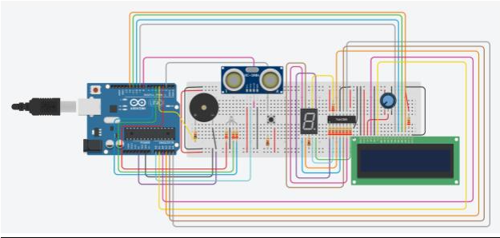

# Car Simulation on Arduino

## Group 4

- Madeline Quang
- Sayfullah Eid

## Description

The project our group is doing is to mimic a car’s distance from the car in front of them using ultrasonics sensors, LEDs and LCD screen. It will indicate to the user whether it is a safe distance they are following or if it is too close. If it is too close, it will let the driver know and if it is really too close, it will safely stop the car so it does not hit the car.

## Components and Topics

- LEDs
- USART
- Timers
- Push buttons
- 7-segment
- LCD
- Shift registers
- Servo motor
- Speaker

## Circuit

